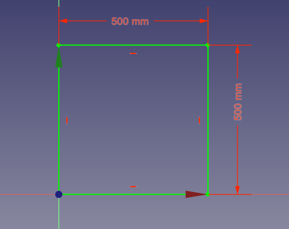
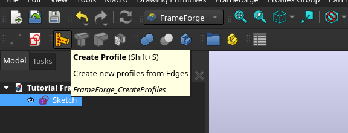
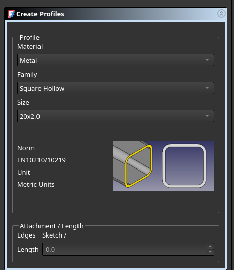
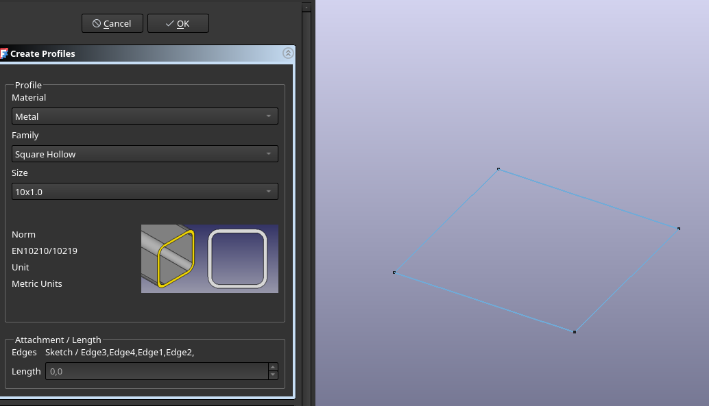
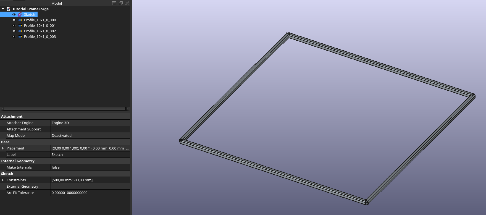

# FrameForge / 型材框架工作台 (Mod 版本 v0.1)

[](https://www.youtube.com/watch?v=CbVGpRtp7rw)

https://github.com/user-attachments/assets/7afd0c91-624a-48f2-9319-2409226ca223

FrameForge is a FreeCAD workbench for designing beams and frames with cut, miter joins, BOM export, and more.

型材框架 是一个 FreeCAD 工作台，用于设计梁和框架结构，支持切割、斜接、BOM 导出等功能。

> **注意**：这是一个 AI 辅助开发的 Mod 版本，安装在 `FrameForge_mod` 目录。代码由 AI 生成，使用前请先测试，操作前备份文件。

---

## v0.1 — Mod 新增功能 / New in Mod

- **自定义型材 (Custom Profile)** — 从选中边创建任意截面的型材
- **钻孔 (Hole)** — 基于草图点/圆/线在型材上打孔，自动生成 Part::Cut
- **哨子连接器 / T 型连接器** — 自动检测 QY 规格，支持内置连接件钻孔
- **图案填充 (Pattern Fill)** — 六边形/圆形/三角形/自定义图案阵列填充
- **通风口 (Vent)** — 基于草图创建带加强筋的通风开口
- **端盖 (End Cap)** — 板式/插入式，支持倒角、圆角、螺纹孔 (M3~M12)
- **角撑板 (Gusset)** — 三角支撑板，带倒角选项
- **铝型材库** — 集成国标/欧标铝型材截面库
- **BOM 动态更新** — 表格单元格使用公式引用型材属性，修改即更新
- **端盖/角撑板参数记忆** — 下次创建自动恢复上次数值
- **BOM 角度修复** — 斜接角度计算修正为 A/2

---

## Features / 功能

- **Create Beams** from sketches or edges / 从草图或边创建梁（金属、木材）
- **Trim, offset, cut, miter cut** / 修剪、偏移、切割、斜接切割
- **Hole** from sketch（打孔）/ 基于草图点/圆/线打孔，自动 Part::Cut
- **Whistle Connector / T-Joint Connector** / 哨子连接器 / T 型连接器（自动检测 QY 规格）
- **Extruded Cutout** from sketch / 拉伸切空
- **Custom Profiles** / 自定义型材
- **Aluminum Extrusion Library** / 铝合金挤压型材库
- **End Miter & End Trim** / 端部斜接与端部修剪
- **Gusset / Corner Bracket** / 角撑板
- **End Cap** / 端盖（含螺纹孔选项 M3~M12）
- **Vent / Louver** / 通风口
- **Pattern Fill** / 图案填充
- **Offset Plane** / 偏移平面
- **Export BOM with cut angles, length, material** / 导出物料清单（含切割角度、长度、材料）
- **TechDraw Balloons** with auto-update / 技术图纸气球标注（自动更新）
- **Populate IDs** for profile management / 型材 ID 自动编号管理
- **Dynamic Data** integration (bundled) / 集成动态数据插件
- **Price / Weight tracking** / 价格/重量追踪


[](https://www.youtube.com/watch?v=leSm4V5qcts)


[](https://ko-fi.com/L3L41KKMJR)

---

## Prerequisite / 前置要求

- FreeCAD ≥ v1.0.x

---

## Installation / 安装

放在 FreeCAD Mod 目录：`%APPDATA%/FreeCAD/v1-1/Mod/FrameForge_mod/`

---

## Quick Start / 快速开始

### Create the skeleton / 创建骨架

Beams are mapped onto Edges or ParametricLine (from a Sketch for instance).

梁映射到边或参数化线（例如来自草图）。

1. Switch to the **型材框架** workbench / 切换到型材框架工作台
2. Create a [Sketch](https://wiki.freecad.org/Sketcher_NewSketch) (choose XY orientation) / 创建草图（选择 XY 方向）
3. Draw a simple square — this is your skeleton / 绘制一个正方形作为骨架
4. Close the Sketch editor / 关闭草图编辑



### Create the frame / 创建框架

1. Launch the **FrameForge Profile** tool / 启动型材工具



2. Select a profile from the lists (Material / Family / Size) / 从列表中选择型材（材料/系列/尺寸）



3. In the 3D view, select edges to apply the profile / 在 3D 视图中选择要应用型材的边



4. Press **OK** — you now have profiles! / 点击确定，型材已创建！



**Voila! Your first frame! / 第一个框架完成！**

For more details, see the [tutorial](docs/tutorial.md) / 更多详情请参阅[教程](docs/tutorial.md)。

---

详细使用说明见 [FrameForge-使用说明.md](docs/FrameForge-使用说明.md)。

---

## Maintainer / 维护者

Vivien HENRY  
vivien.henry@inductivebrain.fr

---

## Credits / 致谢

This workbench references and bundles code from the following open-source projects:

本工作台参考并集成了以下开源项目的代码：

| Project / 项目 | Author / 作者 | Description / 说明 |
|---|---|---|
| [FrameForge](https://github.com/lukh/frameforge) | lukh | Original workbench this project is forked from / 本分支的原始工作台 |
| [MetalWB](https://framagit.org/Veloma/freecad_metal_workbench) | Veloma | Original base workbench (FrameForge predecessor) / FrameForge 的前身 |
| [Dynamic Data (动态数据)](https://github.com/mwganson/DynamicData) | Mark Ganson (TheMarkster) | Dynamic properties system (v2.78, bundled) / 动态属性系统（v2.78，已集成） |
| [EasyProfileFrame](https://github.com/ovo-Tim/EasyProfileFrame) | ovo-Tim | Profile frame workbench / 型材框架工作台 |
| [BOLTS](https://github.com/boltsparts/BOLTS) | Johannes Reinhardt | Open Library of Technical Specifications (extrusion geometry) / 开源技术规格库（挤压型材几何） |

### Special thanks / 特别感谢

- **大海** (QQ group) — Provided aluminum extrusion profile library / 提供铝合金型材轮廓库
  - Bilibili: [space.bilibili.com/3546652184938824](https://space.bilibili.com/3546652184938824?spm_id_from=333.337.0.0)
- Vincent B
- Quentin Plisson
- rockn
- Jonathan Wiedemann

And many others from the [FreeCAD forum thread](https://forum.freecad.org/viewtopic.php?style=5&t=72389)

以及 FreeCAD 论坛相关讨论中的众多贡献者。

---

## How to Add Profiles / 如何添加轮廓

Profiles are defined in multiple places. To add a new profile, follow the steps below:

轮廓定义在多个位置。要添加新轮廓，请按以下步骤操作：

### 1. JSON Dimension Data / JSON 尺寸数据

Edit the JSON file for the material type:

编辑对应材料类型的 JSON 文件：

- `freecad/frameforgemod/resources/profiles/aluminium_extrusion.json` — Aluminum / 铝型材
- `freecad/frameforgemod/resources/profiles/wood.json` — Wood / 木材
- `freecad/frameforgemod/resources/profiles/metal.json` — Steel / 钢材

**Format example / 格式示例** (add under the corresponding family):

```json
{
  "family": "欧标30系列(8.2)",
  "sizes": [
    {"label": "30x30", "Height": 30.0, "Width": 30.0},
    {"label": "30x60", "Height": 30.0, "Width": 60.0}
  ]
}
```

### 2. Cross-Section Sketch / Sheet Body / 截面草图 / 片体

Profile outlines are loaded from `.FCStd` files in the profiles directory:

型材轮廓从 `profiles` 目录下的 `.FCStd` 文件加载：

`freecad/frameforgemod/resources/profiles/`

- File name must match the `<label>` in JSON / 文件名必须与 JSON 中的 `<label>` 一致
- Supported content / 支持的内容：
  - **Sketch** — closed wire sketch of the cross-section / 闭合截面草图
  - **Sheet Body / 片体** — face body representing the cross-section / 表示截面的片体
- Each `.FCStd` should contain ONE sketch or sheet body named the same as the file / 每个 `.FCStd` 文件应包含一个与文件同名的草图或片体

### 3. SVG Outline (Optional) / SVG 轮廓（可选）

For visual reference in the UI, add an SVG:

如需在界面中显示轮廓预览，添加 SVG 文件：

`freecad/frameforgemod/resources/profiles/aluminum/svg/`

### 4. Profile Preview Image / 预览图片

Add a preview PNG to the corresponding folder:

添加预览 PNG 到对应文件夹：

- `freecad/frameforgemod/resources/images/profiles/Metal/`
- `freecad/frameforgemod/resources/images/profiles/Wood/`

### 5. Using Custom Profile Tool / 使用自定义轮廓工具

You can also create profiles directly in FreeCAD:

也可以在 FreeCAD 中直接创建自定义轮廓：

1. Switch to **型材框架** workbench / 切换到型材框架工作台
2. Click **Create Custom Profile** / 点击"创建自定义轮廓"
3. Select a sketch as the cross-section / 选择草图作为截面

---

## LICENSE / 许可证

FrameForge is licensed under the [GPLv3 / LGPLv3](LICENSE).
